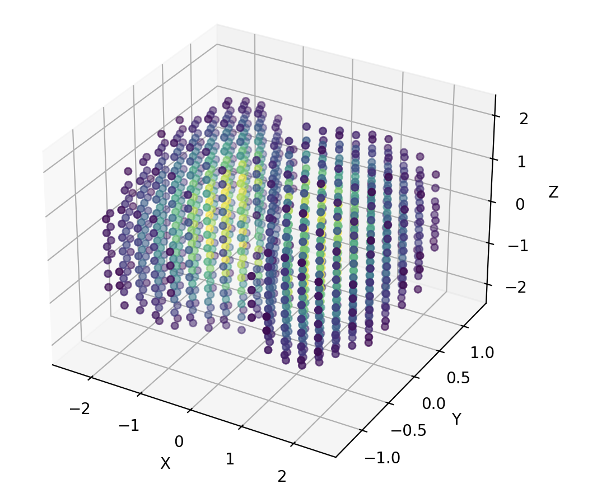
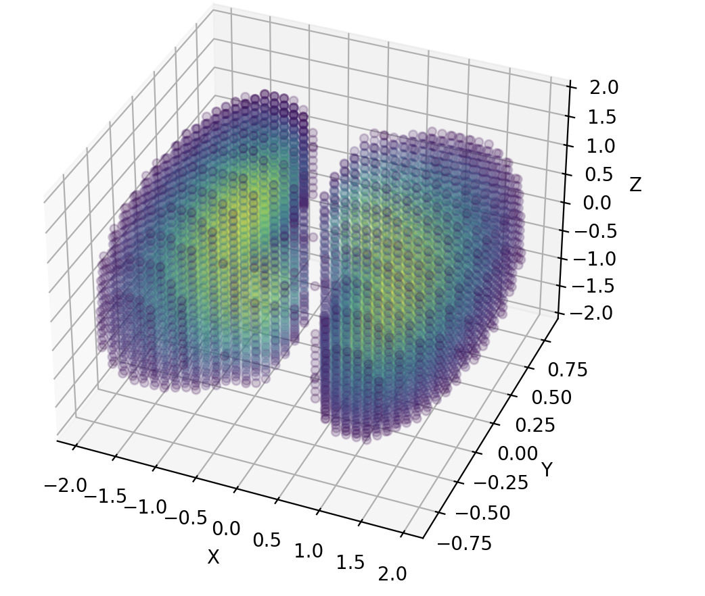
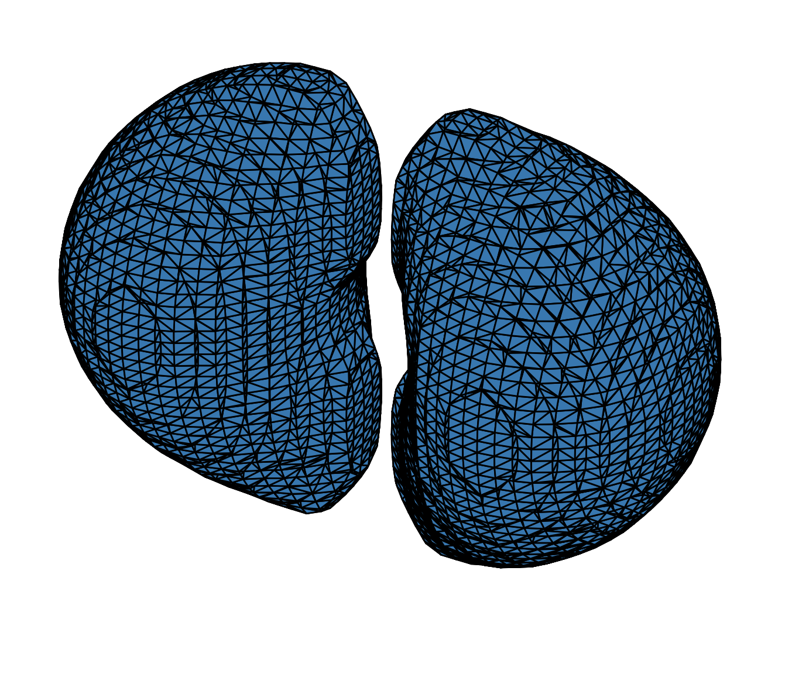
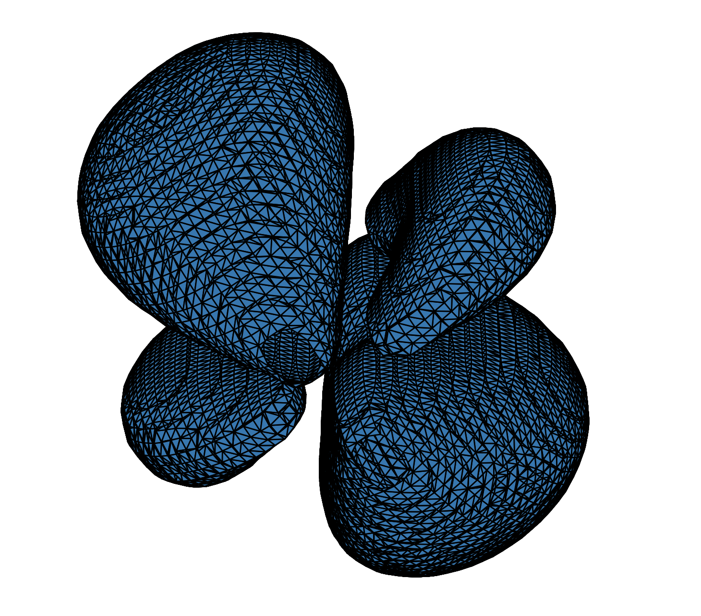

# Plotting Atomic Orbitals with Xarray and Matplotlib

This project implements a fast and efficient way to compute and visualize atomic orbitals using Python. Under the hood, it uses Xarray for data handling with vectorized operations for performance, and Matplotlib for visualization.

## Quickstart:
- **Check out experiment.ipynb for an interactive demonstration.**

## Features

- Compute single-electron atomic wavefunctions with arbitrary quantum numbers
- Efficient evaluation using vectorized operations
- Support for both Cartesian and spherical coordinate systems
- 3D interpolation for high-quality visualizations at minimal computational cost
- Multiple visualization methods: point clouds and isosurfaces
- Marching cubes algorithm for smooth isosurface rendering


## Computing Single-Electron Atomic Orbitals

We can compute the wavefunction for single-electron atomic orbitals, such as the 2p orbital, by specifying the quantum numbers `n`, `l`, and `m`. The associated probability density can then be visualized in 3D using either point cloud visualization, (plots individual grid points where the wavefunction is evaluated) or isosurface visualization, where we make use of the marching cubes algorithm to render smooth surfaces.

### Coordinate Systems

Wavefunctions can be evaluated and plotted in either Cartesian or spherical coordinates by choosing the appropriate `Wavefunction` object:

- `datatypes.CartesianWavefunction` - More convenient for plotting purposes
- `datatypes.RadialWavefunction` - Alternative spherical coordinate implementation, possibly more natural for downstream calculations with physical meaning.

Both classes implement the same interface, allowing users to choose based on their preferences.

### Performance Optimization

Wavefunction evaluation is performed by calling the `eval_wavefunction()` method, which computes values on a grid of points. For higher resolutions, this can be computationally expensive. To address this, the code implements efficient 3D interpolation, allowing users to:

1. Evaluate the wavefunction on a coarse grid (fast, but accurate, better for energy calculations etc)
2. Interpolate to a finer grid for high-quality plotting (minimal overhead, possible deviation from true density so caution advised.)

### Basic Example: Computing a 2p Orbital

```python
# Import required modules
from orbitals import datatypes, visualisation, tools

# Specify the resolution of the grid for wavefunction evaluation
# This defines the number of points in each dimension (x, y, z)
resolution = {"x": 20, "y": 20, "z": 20}

# Create wavefunction object for the 2p orbital (n=2, l=1, m=0)
# r_max specifies the maximum radius from the origin for evaluation
wavefunction = datatypes.CartesianWavefunction.new_1e_atomic_wavefunction(
    resolution=resolution,
    r_max=3,
    n=2, l=1, m=0  # Quantum numbers for 2p_z orbital
)

# Evaluate the wavefunction on the grid
wavefunction.eval_wavefunction()
```

> **Note:** Higher resolutions significantly increase computation time. The interpolation method shown below provides a more efficient approach for high-quality visualizations.

### Visualizing on a Coarse Grid

```python
# Plot the wavefunction using point cloud visualization
fig, ax = visualisation.plot_clipped_points(
    wavefunction, 
    threshold=0.3,
)
```



### High-Quality Visualization Using Interpolation

For better visual quality, we can interpolate the wavefunction to a finer grid. This approach is computationally efficient since interpolation is much faster than direct evaluation on a high-resolution grid.

```python
# Interpolate to a finer grid for improved visualization quality
# The interpolation is nearly instantaneous compared to direct evaluation
highres_wavefunction = tools.interpolate_grid_function(
    wavefunction, 
    new_resolution={'x': 50, 'y': 50, 'z': 50}
)

# Plot the high-resolution wavefunction
# Note: Most computation time is spent on visualization, not interpolation
fig, ax = visualisation.plot_clipped_points(
    highres_wavefunction, 
    threshold=0.5,
    alpha=0.2,  # Semi-transparent points for better visibility at high density
)
```



> **Warning:** While interpolation is excellent for visualization, be cautious when using interpolated data for quantitative calculations (e.g., energy computations) as it may introduce inaccuracies.

## Isosurface Visualization

The `plot_isosurface` function provides an alternative visualization method using the marching cubes algorithm. This creates smooth surfaces representing constant probability density values, offering a cleaner and more intuitive view of orbital shapes.

```python
# Create an isosurface plot
visualisation.plot_isosurface(
    highres_wavefunction, 
    relative_threshold=0.4,
)
```



## Examples: Other Orbital Types

### 4d_z² Orbital

The same workflow can be applied to visualize any atomic orbital. Here's an example of the 4d_z² orbital (n=4, l=2, m=0):

```python
# Create a 4d_z² orbital with larger spatial extent
resolution = {"x": 20, "y": 20, "z": 20}
dz2_wavefunction = datatypes.CartesianWavefunction.new_1e_atomic_wavefunction(
    resolution=resolution,
    r_max=5,  # Larger radius needed for 4d orbitals
    n=4, l=2, m=0  # Quantum numbers for 4d_z² orbital
)

# Evaluate and interpolate for high-quality visualization
dz2_wavefunction.eval_wavefunction()
dz2_highres_wavefunction = tools.interpolate_grid_function(
    dz2_wavefunction, 
    new_resolution={'x': 50, 'y': 50, 'z': 50}
)

# Visualize as isosurface
visualisation.plot_isosurface(
    dz2_highres_wavefunction, 
    relative_threshold=0.1,  # Lower threshold for d orbitals
)
```



## Quantum Number Reference

| Quantum Number | Symbol | Description | Example Values |
|---------------|--------|-------------|----------------|
| Principal | n | Energy level/shell | 1, 2, 3, 4, ... |
| Azimuthal | l | Orbital angular momentum | 0 (s), 1 (p), 2 (d), 3 (f) |
| Magnetic | m | Orbital orientation | -l, -l+1, ..., 0, ..., l-1, l |

### Common Orbital Examples
- **1s**: n=1, l=0, m=0
- **2p_z**: n=2, l=1, m=0  
- **3d_z²**: n=3, l=2, m=0
- **4f**: n=4, l=3, m=0 (or ±1, ±2, ±3)
